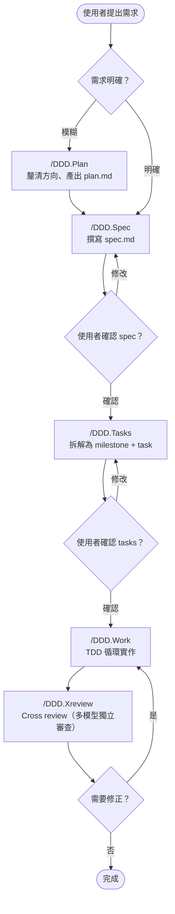
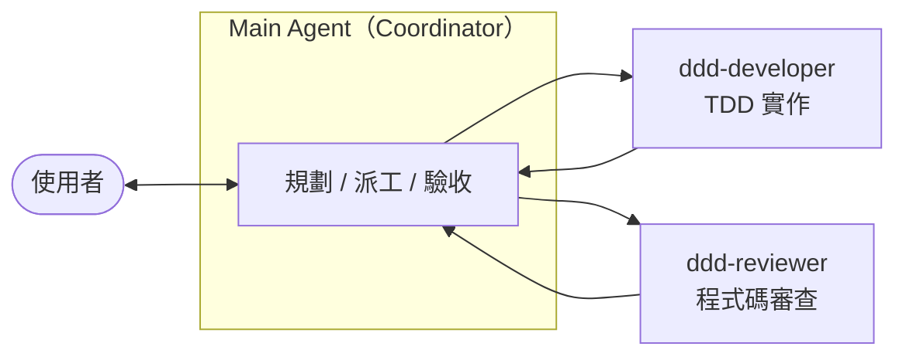

# DDD Workflow

Document Driven Development 工作流——讓 AI agent 用結構化的文件驅動開發，而非直接跳進程式碼。

## 核心理念

**No Code Without Docs, No Code Without Tests.**

每個功能都從文件開始：先釐清需求、寫 spec、拆 tasks，確認後才動手寫程式碼。Main agent 擔任 Coordinator（規劃、派工、驗收），實作和 review 交給專屬 subagent，保護 main agent 的 context window 不被消耗。

## 工作流總覽



## 角色分工



| 角色 | 職責 | 不做什麼 |
|------|------|----------|
| **Coordinator**（main agent） | 需求分析、撰寫 spec、拆解 tasks、派工、驗收 | 不寫 production code、不 debug、不做 review |
| **ddd-developer** | 以 TDD 循環實作功能程式碼與測試 | 不做架構決策、不跳過測試 |
| **ddd-reviewer** | 獨立審查程式碼變更，產出 review 報告 | 不修改程式碼 |

## 文件結構

每個需求對應一個文件包，作為 SSOT（Single Source of Truth）：

```
docs/
├── PRD.md                        # 產品需求文件
├── TECHSTACK.md                  # 技術棧 + 參考文件連結
└── <編號>-<名稱>/                # Sprint 文件包
    ├── plan.md                   # (optional) 前置規劃
    ├── research.md               # (optional) 技術調研
    ├── spec.md                   # 規格書：User Story、驗收條件、ADR
    ├── tasks.md                  # Milestone + task checklist
    └── works.md                  # 開發日誌：決策與問題記錄
```

## Skills

主流程 skills（按順序使用，指令名稱與文件名皆為 alphabetical order — by design）：

| Slash Command | 用途 | 何時觸發 |
|---------------|------|----------|
| `/DDD.Plan` | 需求模糊時釐清方向，產出 plan.md | 「我有個想法…」 |
| `/DDD.Spec` | 撰寫正式規格書 spec.md | 需求明確，準備定義規格 |
| `/DDD.Tasks` | 將 spec 拆解為 milestone + task checklist | spec 確認後 |
| `/DDD.Work` | 以 TDD 循環實作（支援平行派工） | tasks 確認後，開始寫 code |
| `/DDD.Xreview` | 多模型 cross review | 實作完成，準備提交前 |

輔助 skills：

| Slash Command | 用途 |
|---------------|------|
| `/DDD.ArchitectRefactor` | 架構層級重構——模組邊界、依賴方向、職責分配 |
| `/DDD.AgentBrowser` | E2E 除錯——用瀏覽器自動化系統性地除錯前端問題 |
| `/DDD.CreateHooks` | 設定 Claude Code hooks（安全防護、lint、commit review） |

## 安裝

### 搭配 [AGENTS](https://github.com/applepig/AGENTS) wrapper（推薦）

```bash
git clone --recursive https://github.com/applepig/AGENTS.git
cd AGENTS
npm run deploy        # symlink 到 ~/.claude/, ~/.gemini/, ~/.codex/
```

### 手動安裝（僅 Claude Code）

```bash
git clone https://github.com/applepig/ddd-workflow.git ~/.claude/ddd-workflow

# Symlink 指令檔
ln -sf ~/.claude/ddd-workflow/references/AGENTS.md ~/.claude/CLAUDE.md

# Symlink skills
for skill in ~/.claude/ddd-workflow/skills/ddd.*/; do
  ln -sf "$skill" ~/.claude/skills/"$(basename "$skill")"
done

# Symlink agents
for agent in ~/.claude/ddd-workflow/agents/ddd-*.md; do
  ln -sf "$agent" ~/.claude/agents/"$(basename "$agent")"
done
```

## 核心原則

- **SSOT**：每個需求一個文件包，文件就是唯一真相來源
- **No Code Without Docs**：spec + tasks 獲得確認前，嚴禁寫程式碼
- **No Code Without Tests**：修改 production code 前，必須先有測試
- **Sync on Finish**：完成任務前，先更新 tasks.md 和 works.md
- **明確的決策點**：需要使用者決策時，必須暫停等待確認

## 專案結構

```
ddd-workflow/
├── skills/                       # Skill 定義（slash commands）
│   └── ddd.<name>/
│       ├── SKILL.md              # YAML frontmatter + 指令內容
│       └── references/           # (optional) 參考資料
├── agents/                       # Subagent 定義
│   └── ddd-<role>.md             # YAML frontmatter + system prompt
└── references/
    └── AGENTS.md                 # 共用指令檔（coding style、工具偏好等）
```

## License

MIT
