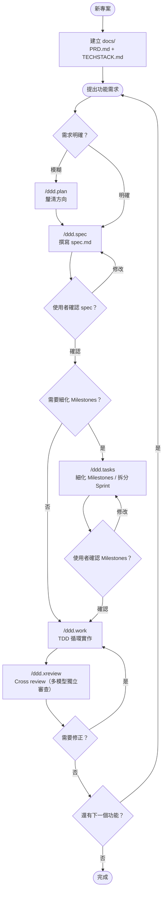
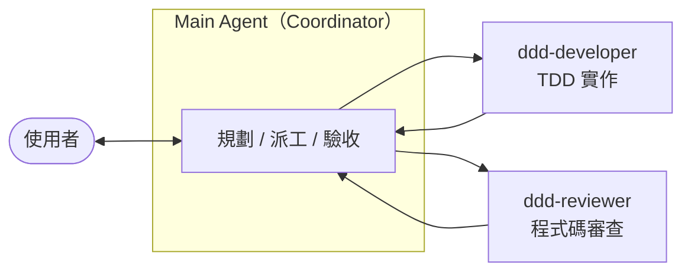

# DDD Workflow

Document Driven Development 工作流——讓 AI agent 用結構化的文件驅動開發，而非直接跳進程式碼。

## 核心理念

**No Code Without Docs, No Code Without Tests.**

每個功能都從文件開始：先釐清需求、寫 spec，確認後才動手寫程式碼。Main agent 擔任 Coordinator（規劃、派工、驗收），實作和 review 交給專屬 subagent，保護 main agent 的 context window 不被消耗。

## 安裝 Skills

使用 Agent Skills CLI 安裝全部 DDD skills：

```bash
npx skills add applepig/ddd-workflow --skill "*" -g -a claude-code -a opencode -a codex -a gemini-cli
```

先檢查可用 skills：

```bash
npx skills add applepig/ddd-workflow --list
```

如果你已 clone 本 repo，也可以從本機目錄安裝：

```bash
npx skills add . --skill "*" -g -a claude-code -a opencode -a codex -a gemini-cli
```

## Agents 與 Runtime Scripts

`npx skills` 只安裝 `skills/`。本 package 另外提供 `bin/` entrypoints，處理 agents、instruction files、config 與 runtime scripts。

建立平台 agents 產物：

```bash
npm run agents:build
```

部署 non-skill 項目到本機 agent 設定目錄：

```bash
npm run agents:deploy -- --dry-run
npm run agents:deploy
```

可指定單一平台：

```bash
npm run agents:deploy -- claude --dry-run
npm run agents:deploy -- opencode
```

## 工作流總覽


```mermaid
flowchart TD
    Start([新專案]) --> Init["建立 docs/<br/>PRD.md + TECHSTACK.md"]
    Init --> Feature([提出功能需求])

    Feature --> Clarity{需求明確？}

    Clarity -- 模糊 --> Plan["/ddd.plan<br/>釐清方向"]
    Plan --> Spec

    Clarity -- 明確 --> Spec["/ddd.spec<br/>撰寫 spec.md"]
    Spec --> UserSpec{使用者確認 spec？}
    UserSpec -- 修改 --> Spec
    UserSpec -- 確認 --> NeedTasks{需要細化 Milestones？}

    NeedTasks -- 否 --> Work
    NeedTasks -- 是 --> Tasks
    Tasks["/ddd.tasks<br/>細化 Milestones / 拆分 Sprint"] --> UserTasks{使用者確認 Milestones？}
    UserTasks -- 修改 --> Tasks
    UserTasks -- 確認 --> Work

    Work["/ddd.work<br/>TDD 循環實作"] --> Review
    Review["/ddd.xreview<br/>Cross review（多模型獨立審查）"] --> Fix{需要修正？}
    Fix -- 是 --> Work
    Fix -- 否 --> Next{還有下一個功能？}
    Next -- 是 --> Feature
    Next -- 否 --> Done([完成])
```

## 角色分工


```mermaid
flowchart LR
    User([使用者]) <--> Coord

    subgraph Main["Main Agent（Coordinator）"]
        Coord[規劃 / 派工 / 驗收]
    end

    Coord --> Dev["ddd-developer<br/>TDD 實作"]
    Coord --> Rev["ddd-reviewer<br/>程式碼審查"]

    Dev --> Coord
    Rev --> Coord
```

| 角色 | 職責 | 不做什麼 |
|------|------|----------|
| **Coordinator**（main agent） | 需求分析、撰寫 spec、必要時細化 Milestones、派工、驗收 | 不寫 production code、不 debug、不做 review；`/ddd.fixbug` 的例外條件見該 skill |
| **ddd-developer** | 以 TDD 循環實作功能程式碼與測試 | 不做架構決策、不跳過測試 |
| **ddd-reviewer** | 獨立審查程式碼變更，產出 review 報告 | 不修改程式碼 |

## 文件結構

每個需求對應一個文件包，作為 SSOT（Single Source of Truth）：

```
docs/
├── PRD.md                        # 產品需求文件（專案層級，只建一次）
├── TECHSTACK.md                  # 技術棧 + 參考文件連結（專案層級，只建一次）
└── <編號>-<名稱>/                # Sprint 文件包（每個功能一個）
    ├── plan.md                   # (optional) 初步筆記
    ├── research.md               # (optional) 技術調研
    ├── spec.md                   # 規格書：User Story、驗收條件、ADR、輕量 Milestones
    └── works.md                  # 成果與決策紀錄
```

專案初始化時先建立 `PRD.md`（產品目標、使用者、範圍）和 `TECHSTACK.md`（語言、框架、部署環境），後續每個功能的 spec 都以此為基礎。

## Skills

主流程 skills（按順序使用，指令名稱與文件名皆為 alphabetical order — by design）：

| Slash Command | 用途 | 何時觸發 |
|---------------|------|----------|
| `/ddd.plan` | 需求模糊時釐清方向 | 「我有個想法…」 |
| `/ddd.spec` | 撰寫正式規格書 spec.md，含輕量 Milestones | 需求明確，準備定義規格 |
| `/ddd.tasks` | 細化 Milestones 或拆分 Sprint | spec 確認後，且需要細化或拆分 Sprint |
| `/ddd.work` | 以 TDD 循環實作（支援平行派工） | spec 確認後 |
| `/ddd.xreview` | 多模型 cross review | 實作完成，準備提交前 |

輔助 skills：

| Slash Command | 用途 |
|---------------|------|
| `/ddd.fixbug` | Bug 快速修復；適用條件與例外限制見該 skill |
| `/ddd.agent-browser` | E2E 除錯——用瀏覽器自動化系統性地除錯前端問題 |

## 核心原則

- **SSOT**：每個需求一個文件包，文件就是唯一真相來源
- **No Code Without Docs**：spec 獲得確認前，嚴禁寫程式碼
- **No Code Without Tests**：修改 production code 前，必須先有測試
- **Sync on Finish**：完成任務前，先更新任務來源和 works.md
- **明確的決策點**：需要使用者決策時，必須暫停等待確認

## 專案結構

```
ddd-workflow/
├── skills/                       # Agent Skills 定義（slash commands）
│   └── ddd.<name>/
│       ├── SKILL.md              # YAML frontmatter + 指令內容
│       └── references/           # (optional) 參考資料
├── agents/                       # Claude-compatible canonical agents
├── bin/                          # public CLI entrypoints
├── chunks/                       # bin runtime chunks
├── deploy/                       # bin deploy runtime
├── scripts/                      # package-level runtime scripts
├── config/                       # user-editable config templates
├── policies/                     # CLI policy files
├── references/
│   └── AGENTS.md                 # 共用指令檔（coding style、工具偏好等）
└── package.json
```

## License

MIT
