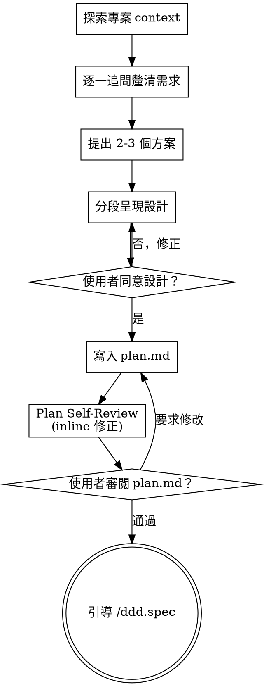

# ddd.brainstorming — 把 idea 變成 plan（greenfield）

透過自然的協作對話，把想法變成完整的設計與規格。先理解專案脈絡，然後一次一題地追問以釐清想法。理解清楚後呈現設計、取得使用者同意。

**適用範圍**：greenfield——新專案、新模組、沒既有 code 可參考的情境。從一張白紙生出結構。如果是在既有專案中延伸或修改功能（brownfield），改用 `/ddd.plan`。

改編自 Anthropic superpowers:brainstorming skill，加上 DDD 工作流的契約（SSOT 路徑、AskUserQuestion 強制、終點導向 /ddd.spec）。

<HARD-GATE>
在呈現設計並獲得使用者明確同意前，嚴禁 invoke 任何實作 skill、撰寫程式碼、建立專案 scaffold、或做任何實作行為。這條規則適用於每一個專案，不論你覺得它有多簡單。
嚴禁自行假設商業邏輯——需求模糊時必須提問。
</HARD-GATE>

## 反模式：「這個太簡單不需要設計」

每個專案都要走這個流程。一個 todo list、一個單函式工具、一個設定檔變更——全部都要。「簡單」的專案正是未經檢驗的假設最容易造成浪費的地方。設計可以很短（真正簡單的專案寫幾句話就好），但你**必須**呈現給使用者確認。

## Checklist

你必須為以下每個項目建立 task 並依序完成：

1. **探索專案 context** — 讀既有文件（PRD.md、README.md、TECHSTACK.md）、檢查相關 codebase、看最近的 commits
2. **逐一追問釐清需求** — 一次一題，釐清目的、限制、成功條件；決策點用 `AskUserQuestion`；能從 codebase 得到的答案自己查
3. **提出 2-3 個方案** — 附取捨分析，把你推薦的方案放第一個並解釋為什麼
4. **分段呈現設計** — 每段篇幅按複雜度縮放，每段確認後再進下一段
5. **寫入 plan.md** — 存到 `docs/<編號>-<名稱>/plan.md`
6. **Plan Self-Review** — inline 檢查 Placeholder / 一致性 / Scope / 歧義四項（見下方）
7. **使用者審閱 plan.md** — 請使用者 review 寫好的檔案，取得最終確認
8. **引導進入 /ddd.spec** — 轉交到規格制定階段

## Process Flow



**終止狀態是引導 `/ddd.spec`。** brainstorming 結束後**唯一**可以執行的下一步 skill 是 `/ddd.spec`。不要 invoke `/ddd.tasks`、`/ddd.work`、`/ddd.architect-refactor`，或任何其他實作 skill。

## The Process

### 理解想法

- 先查專案現況（檔案、文件、最近的 commits）
- **決策點必須用 `AskUserQuestion` 工具**——不可用一般對話文字代替。這確保流程在決策點明確暫停、等待使用者輸入（AGENTS.md 規定）
- **能從 codebase 查到的答案自己查**——用 Read、Grep、或 Explore agent，不要問使用者那些翻一下檔案就能知道的事
- 問細節問題前，先評估範圍：如果需求描述了多個獨立子系統（例如「做一個有聊天、檔案儲存、計費、數據分析的平台」），立刻標記出來。不要在一個需要先拆解的專案上浪費問題去鑽細節
- 如果專案太大、一份 plan 裝不下，協助使用者拆成子專案：哪些部分是獨立的、彼此如何關聯、該以什麼順序建造。然後對第一個子專案走正常的設計流程。每個子專案都有自己的 plan → spec → tasks → work cycle
- 範圍合適的專案，一次一題地追問以釐清想法
- 能用 2-4 個選項框架的問題就用 `AskUserQuestion` 的選項格式呈現——開放式問題只在無法預判答案範圍時使用
- **一則訊息只問一個問題**——如果某個主題需要更多探索，拆成多則訊息
- 聚焦在理解：目的、限制、成功條件

### 探索方案

- 提出 2-3 個不同方案並附取捨
- 口語化呈現選項，附上你的推薦與理由
- **把你推薦的方案放第一個**並解釋為什麼

### 呈現設計

- 當你相信自己理解要建造什麼時，開始呈現設計
- **每段篇幅按複雜度縮放**：簡單直接的地方幾句話就好、細節多的地方可以到 200-300 字
- 每段呈現後問一下「這段看起來對嗎」
- 要涵蓋：架構、組件、資料流、錯誤處理、測試
- 準備好在某處說不通時退回釐清

### 為隔離與清晰而設計

- 把系統拆成更小的單元，每個單元有**單一明確的用途**、透過**定義好的介面**溝通、可以**獨立理解和測試**
- 對每個單元，你應該能回答：它做什麼、怎麼使用它、它依賴什麼
- 能否不讀內部實作就理解這個單元做什麼？能否改內部實作而不影響呼叫端？如果答案是不，邊界需要重新劃
- 小而邊界清楚的單元對你自己（AI agent）也更好處理——你對能一次 hold 在 context 裡的程式碼推理比較強，檔案過大往往意味著它做太多事

### 在既有 codebase 中工作

- 提案改動前先探索現有結構。遵循既有 pattern
- 如果既有 code 有問題會影響這次工作（例如檔案過大、邊界模糊、職責混亂），將針對性的改善納入設計的一部分——像好的開發者會順手改善自己動到的 code
- 不要提不相關的重構。專注在服務當前目標

## 設計完成之後

### 撰寫文件

- 將確認後的設計（plan）寫入 `docs/<編號>-<名稱>/plan.md`
  - 如果使用者偏好其他路徑，使用者的指定優先於此預設
- 用清晰簡潔的文字
- **commit 需等使用者明確同意**——設計完成或 plan 寫好都不等於提交授權（AGENTS.md 的 commit 紀律）

### Plan Self-Review

寫完 plan.md 後，用新鮮的眼光檢查：

1. **Placeholder 掃描**：有沒有「TBD」、「TODO」、空白段落、或模糊的需求？補完，或把確實待解的移到 Open Questions
2. **內部一致性**：有沒有段落彼此矛盾？Potential Directions 是否對應 High-level Goals？Open Questions 中的問題是否已在其他段落隱性解答了？
3. **Scope 檢查**：這個範圍夠聚焦到一份 spec 能裝下嗎？還是需要再拆成子專案？
4. **歧義檢查**：有沒有哪個描述可以被兩種方式解讀？挑一個寫明確

發現問題直接 inline 修正，不需要重跑整個流程——修了就往下走。

### User Review Gate

Self-Review 通過後，請使用者審閱 plan.md 才能繼續：

> 「Plan 已寫入 `docs/<編號>-<名稱>/plan.md`。請你審閱一下，有任何想調整的地方告訴我，確認後我們就進入 `/ddd.spec` 寫正式規格。」

等使用者回應。如果要求修改，改完後**重跑 Plan Self-Review**。使用者確認後才能進下一步。

### 進入實作

- 引導使用者執行 `/ddd.spec` 撰寫正式規格
- **不要** invoke 任何其他 skill。`/ddd.spec` 是下一步

## plan.md 大綱

```markdown
# <功能名稱>

## 背景 (Background)
為什麼要做這個功能、解決什麼痛點

## 粗略目標 (High-level Goals)
- 條列式描述預期達成的目標

## 可能的方向 (Potential Directions)
- 方案 A（推薦）：...
  - 優點：...
  - 缺點：...
- 方案 B：...

## 待釐清事項 (Open Questions)
- 尚未解決的技術或規格問題
- 若有需調研的，直接用原生工具查完再寫進來

## 下一步 (Next Step)
建議直接寫 spec，或說明還缺什麼資訊
```

## Key Principles

- **一次一題** — 不要用多個問題轟炸使用者
- **選擇題優先** — 能用選項框架的問題比開放式問題更容易回答
- **決策點用 `AskUserQuestion`** — 不可用對話文字代替（AGENTS.md）
- **先探索後提問** — 能從 codebase 得到的答案自己查，不要問使用者（AGENTS.md）
- **YAGNI 徹底執行** — 從所有設計中積極砍功能。越早砍越便宜，不要把「以後可能需要」帶進 spec
- **探索替代方案** — 定案前永遠先提 2-3 個方案，推薦項放第一
- **漸進式確認** — 分段呈現、逐段確認，不要一次丟整份文件
- **保持彈性** — 某處說不通時退回釐清

## 產出

- `docs/<編號>-<名稱>/plan.md`
- （選擇性）`docs/<編號>-<名稱>/research.md`——技術調研寫這裡，不要塞進 plan.md

## 結束條件

使用者確認 plan.md 後，引導使用者執行 `/ddd.spec`。

如有技術問題需要調研，直接用原生工具（Explore agent、WebSearch、WebFetch）進行，將結論記錄在同資料夾的 `research.md` 中。
