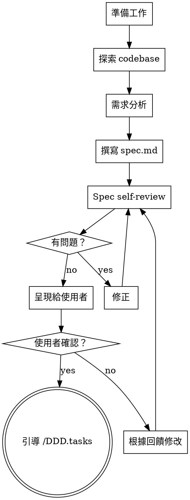

# DDD:spec — 規格制定

規格制定階段。根據需求（或 plan/research 的成果）撰寫正式的規格書。

<HARD-GATE>
嚴禁在 spec.md 獲使用者確認前撰寫任何實作程式碼。
嚴禁省略邊界案例——每份 spec 至少列出一種 Edge Case。
嚴禁引入 docs/TECHSTACK.md 以外的技術而不在 ADR 中說明。
</HARD-GATE>

## Checklist

你必須為以下每個項目建立 task 並依序完成：

1. **準備工作** — 建立/切換 feature branch、確認文件包、讀取 plan.md 與專案脈絡
2. **探索現有 codebase** — 了解現有架構、pattern、相關模組
3. **需求分析** — 釐清 User Story、驗收條件、邊界案例
4. **撰寫 spec.md** — 按模板填寫
5. **Spec self-review** — 4 項檢查（見下方）
6. **使用者審閱** — 呈現 spec、等待確認、根據回饋修改

## Process Flow



## 設計指引

### 沿用現有 Pattern

探索 codebase 時，先了解現有結構再提案。Spec 中的設計應與既有 pattern 一致。如果現有 code 有問題會影響本次開發（例如檔案過大、職責不清、邊界模糊），將改善納入 spec 的一部分——但不做無關的重構。

### Design for Isolation

將系統拆成職責清晰的小單元，每個單元應：

- 有一個明確的用途
- 透過定義好的介面溝通
- 可以獨立理解和測試

檢驗標準：能否不讀內部實作就理解這個單元做什麼？能否改內部實作而不影響呼叫端？如果不行，邊界需要重新劃。

## 準備工作細節

- 建立並切換至 feature branch：`git checkout -b feat/<編號>-<名稱>`（若已有分支則切換過去）。**branch 名稱中的 `<編號>-<名稱>` 必須與文件包 `docs/<編號>-<名稱>/` 完全一致**——這是從程式碼追溯需求的唯一索引，命名不一致會切斷追溯鏈。
- 確認或建立 `docs/<編號>-<名稱>/` 資料夾
- 讀取現有的 plan.md、research.md（如果有的話）
- 讀取 `docs/PRD.md`、`docs/TECHSTACK.md` 了解專案脈絡

## spec.md 模板

```markdown
# <功能名稱>

## 目標
簡述這個功能要達成什麼。

## 非目標
明確列出不在範圍內的事項。

## User Story
作為 <角色>，我想要 <功能>，以便 <價值>。

### 驗收條件
- [ ] 條件 1
- [ ] 條件 2
- [ ] 條件 3

## 相關檔案
- `src/path/to/file.js` — 說明

## 介面/資料結構 (API / Data Structure)
（必須明確標示通訊協定：REST / SSE / WebSocket，並提供 Request / Response 的 JSON 範例）

## 邊界案例
- Case 1：描述與處理方式

## ADR（Architecture Decision Record）
- 決策：選用 X 方案
- 原因：...
- 替代方案：Y（為何不選）
```

> **ADR 寫作要點**：重點是記錄「為什麼選 A 而不選 B」——未來的維護者需要的是決策脈絡，而非單純的結論。替代方案不需要長篇大論，一兩句說明被排除的理由即可。

## Spec Self-Review

寫完 spec.md 後，用新鮮的眼光檢查：

1. **Placeholder 掃描**：有沒有「TBD」、「待確認」、空白段落？補完或移至 Open Questions
2. **內部一致性**：目標、User Story、驗收條件之間有沒有矛盾？介面設計是否支撐所有驗收條件？
3. **Scope 檢查**：這個範圍適合一個 sprint 嗎？還是需要再拆？
4. **歧義檢查**：有沒有哪個驗收條件能被兩種方式解讀？挑一個寫明確

發現問題直接修正，不需要重跑整個流程。

## User Review Gate

Self-review 通過後，向使用者呈現 spec：

> 「Spec 已寫入 `docs/<編號>-<名稱>/spec.md`。請審閱內容，有需要調整的地方告訴我。確認後我們就進入 `/DDD.tasks` 拆解任務。」

等待使用者回應。如果要求修改，改完後重跑 Self-Review。使用者確認後才結束。

## 產出

- `docs/<編號>-<名稱>/spec.md`
- Feature branch: `feat/<編號>-<名稱>`

## 結束條件

使用者確認規格後，引導使用者執行 `/DDD.tasks`。
